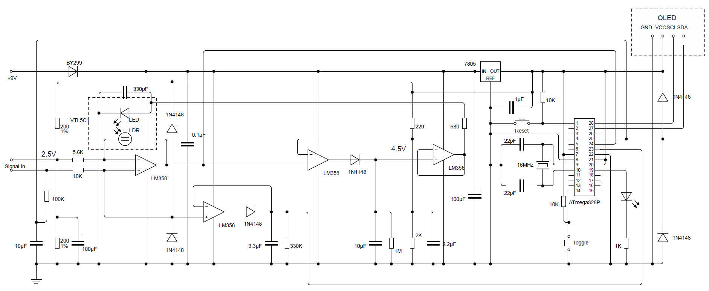

# Low-Cost Spectrum Analyzer cum THD Meter Using ATmega328P

## Overview
This project presents a **low-cost, standalone spectrum analyzer and THD meter** built using an **ATmega328P microcontroller**. It performs **real-time FFT-based spectrum visualization, harmonic identification up to the 9th order, and THD measurement**, all on a compact OLED display.  

Traditional commercial instruments offering these features are expensive, while most DIY designs lack either real-time display, harmonic analysis, or accurate THD calculation. This project addresses all these limitations.

---

## Download the Code

View or download the code here: [SpectrumAnalyzer_THD.ino](https://github.com/psdaphadar/SpectrumAnalyzer_THD/blob/main/SpectrumAnalyzer_THD.ino)

---

## System Features
- **Real-time FFT spectrum display** up to 9th harmonic  
- **THD calculation** with smoothing for accurate readings  
- **Frequency measurement** with ADC delay correction  
- **DC and peak voltage measurements** from analog front-end  
- **Optimized analog signal conditioning** for accurate amplitude and DC measurement  
- **Compact OLED display** showing spectrum bars, harmonics, frequency, THD, and DC level  

---

## System Overview
The system consists of **two main blocks**:

### 1. ATmega328P Microcontroller
- ADC sampling of three inputs  
- FFT computation using 'fix_fft' library  
- THD calculation by identifying fundamental and harmonics  
- Averaging buffers for smooth readings  
- Frequency correction using ADC timing adjustment  
- Outputs spectrum, harmonic amplitudes, frequency, DC, and THD to OLED  

### 2. Analog Signal Conditioning Front-End
- **A0 (Amplitude Detector):** Measures true peak amplitude from a dedicated peak detector  
- **A1 (FFT Input):** AGC-amplified waveform for FFT processing  
- **A2 (DC Average):** RC-averaging network provides DC level  

> Feeding DC directly from circuits to A0/A2 reduces software ADC load, minimizing spectral leakage.

---

## Circuit Description
- Input waveform is **DC-coupled** and biased to mid-rail (~2.5V)  
- **AGC Stage:** VTL5C1 optocoupler + LM358 op-amps to maintain ~4Vpp amplitude  
- Separate **peak-detector (A0)** and **RC averaging (A2)** ensure accurate amplitude and DC measurement  
- OLED display connected via **I²C (A4–A5)**, displaying harmonic bars, frequency, THD, and DC simultaneously  
- **16 MHz crystal** ensures precise timing  

### Circuit Diagram
  
> See the diagram above for the complete setup.

---

## Working Principle

### 1. Frequency Measurement
- Counts rising edges on A1 using a Schmitt trigger threshold  
- Corrects frequency for ADC conversion delay  
- Smoothed frequency used for FFT sampling  

### 2. Dynamic Sampling Rate
- FFT requires ~7 cycles per 128 samples  
- Sampling rate: Fs = SignalFreq × (N/7 + 1)  
- Corrects ADC delay to ensure proper FFT alignment  

### 3. Amplitude & Voltage Checks
- Voltage range check (0.2V–4.8V), error flag if exceeded  

### 4. FFT Computation
- Uses `fix_fft` library  
- Fundamental and harmonics identified accurately  
- Only first 9 harmonics used for THD  

### 5. THD Calculation
- THD (%) = sqrt(sum_of_squared_harmonics) / fundamental × 100  
- Smoothed over multiple readings  

### 6. Display Logic
- OLED shows spectrum bars, numerical harmonic amplitudes, frequency, THD, and DC voltage  
- Optional button toggles between full spectrum and harmonics-only display  

---

## Practical Limitations
- Only first 9 harmonics considered; higher harmonics in pulse-like waveforms may underestimate THD  
- Frequency range: 38–250 Hz (**best up to 60 Hz**)  
- ADC conversion delay, quantization error, and OLED I²C refresh limit performance at higher frequencies  
- Effective ADC sampling limited to ~1.2 kHz due to OLED refresh time  

---

## Applications
- Audio testing of low-frequency signals  
- Educational tool for FFT, THD, and ADC concepts  
- Low-cost DIY labs and experiments  

---

## Future Improvements
- Extend frequency range with faster ADC  
- Higher-resolution displays with more FFT bins  
- PC interface for logging and advanced analysis  
- Integration with DAC for combined generation + measurement  

---

## License
Copyright (c) 2025 Partha Sarathi Daphadar  
All Rights Reserved.

**PERMISSION:**  
You may study, reference, and modify this software for personal, educational, or non-commercial research purposes only.  
You must give proper credit to the author whenever you use it.

**RESTRICTIONS:**  
- Commercial use, selling, sublicensing, or redistribution of this software, in whole or in part, is strictly prohibited without prior written permission from the author  
- You may not remove or alter this copyright notice or these terms  

**DISCLAIMER OF WARRANTY:**  
This software is provided "AS IS," without any warranties, express or implied, including but not limited to fitness for a particular purpose, accuracy, or error-free operation.  
The author makes no guarantee that it will work correctly or meet your specific needs  

**LIMITATION OF LIABILITY:**  
You use this software at your own risk.  
The author shall not be liable for any damages, losses, or problems arising from its use, including hardware damage, data loss, or personal injury  

**BY USING, COPYING, MODIFYING, OR DISTRIBUTING THIS SOFTWARE, YOU AGREE TO THESE TERMS.**

